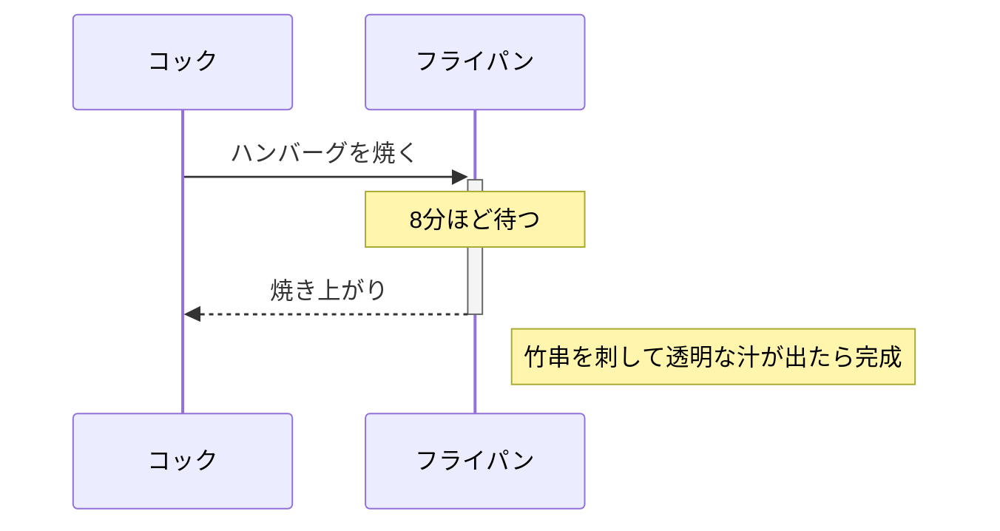

お試し投稿

```mermaid
sequenceDiagram

    participant cook as コック
    participant kitchenware1 as フライパン

    cook ->>+ kitchenware1: ハンバーグを焼く
    Note over kitchenware1: 8分ほど待つ
    kitchenware1 -->>- cook: 焼き上がり
    Note right of kitchenware1: 竹串を刺して透明な汁が出たら完成

```