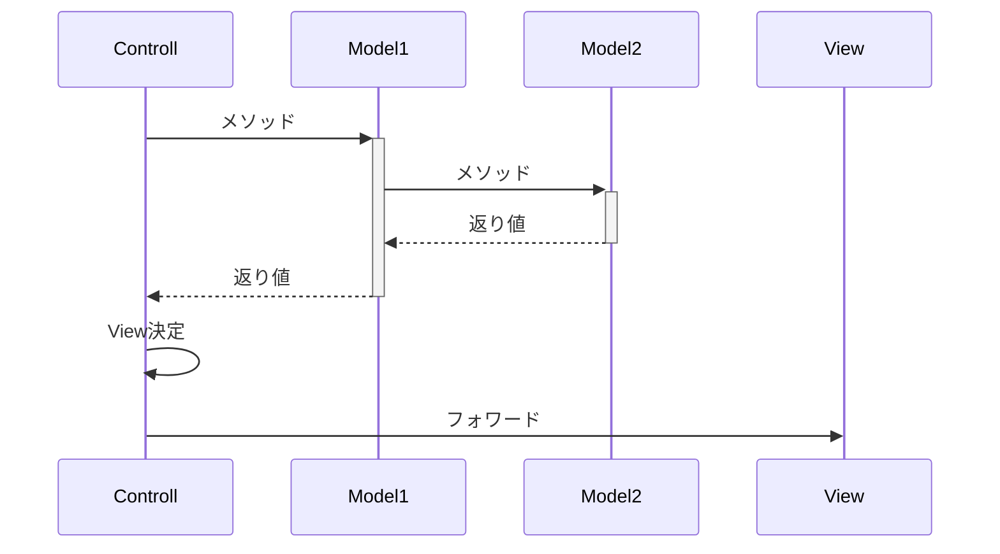
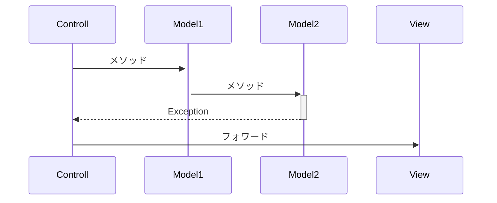

# Exception

javaにはというか現在主流のプログラミング言語ではExceptionという仕組みがある。

あらかじめ予測されたトラブルに対してExceptionを定義し、
トラブルを発生させた処理の呼出し元に対応を促す仕組み。

## Exceptionの初歩的な使い方

### Exceptionの定義
Exceptionは必要に応じて定義する。
Exceptionを継承したクラスがExceptionとして動作する。

    public class ClashException extends Exception {
    }

### トラブルが発生しうる処理側
-処理の宣言部にどんなExceptionが発生するのかを宣言しておく
-トラブルを検知した時点でExceptionを生成してthrowする
    throw した時点で処理を終了し、呼出し元の処理へ飛ぶ。

    public void run() throws ClashException {
      if (status == 目の前に小石がある) {
        throw new ClashException();
      }
      move(spead);
    }

### 処理の呼出し側
-呼び出す処理をtryブロックで囲み、発生しうるexceptionに対してのcatchブロックとトラブル対応を記載する。

    public void draw() {
       for (People people : peoples) {
         try {
           people.move();
         } catch (小石につまづいたException e) {
           keganinList.add(people);
         }
       }
    }

-トラブル対応を呼び出し元で直接対応しない場合は throwsでさらに上の呼出し元に例外を処理させることもできる
    この場合例外発生すると処理を即時終了し、呼出し元の処理へ飛ぶ。

    public void draw()  throws ClashException {
       for (People people : peoples) {
           people.move();
       }
    }


## RuntimeException
Exceptionの中には特殊な位置づけのExceptionとして「RuntimeException」がある。<br>
直訳すると「実行時例外」実際に動かしてみるまでわからないということ。<br>
RuntimeExceptionはExceptionを継承したクラスではあるが、<br>
呼出し元がキャッチやthrowsでExceptionを伝搬することを強制されない。<br>
処理が中断されないわけではなく、
いずれかの呼出し元がキャッチされるところまでthrowされる。

### RuntimeExceptionの用途
RuntimeExceptionは主に、使う側が対応する必要や対応できない例外のために使われる。<br>
例えばファイルの読み込みや書き込みの失敗に発生する「IOException」はRuntimeExceptionの継承で実装されている。<br>
ファイルの読み込みや書き込みの失敗原因は
アプリケーションの問題、動作しているコンピュータのトラブル、
別アプリケーションで同じファイルを扱ったなどのアプリケーションを使用する側の問題などで
アプリケーションだけの責任で対処ができないからだ。

対応できないことが明らかな例外をわざわざthrowでつないでいくのは無駄ということ。

## ExceptionのNGな使い方
Exceptionでやってはいけない使い方と理由、代案を紹介する

### Exceptionを直接指定してキャッチ
```
    try {
      people.move();
    } catch (Exception e) {
      keganinList.add(people);
    }
```

ExceptionはRuntimeExceptionも含め多くのExceptionをキャッチしてしまう。
使用しているフレームワークなどで処理される予定のRuntimeExceptionなどもキャッチしてしまうことになる。

複数のExceptionに対して同じ対応をとりたいということなら以下のように

```
    try {
      people.move();
    } catch (ClashException | SQLException | IllegalArgumentException e) {
      keganinList.add(people);
    }
```

### Exceptionをthrows宣言

```
    public void draw()  throws Exception {
      people.move();
    }

```
結局どんな例外が返ってくるかわからないなら対処しようがないし意味がない。
使用したライブラリなどから色んなExceptionが出る際に
エラーメッセージやスタックトレースを共通処理で画面に出す必要があるということなら以下のように

```
    public class AppException extends RuntimeException {
    }

    public void draw()  {
      try {
        people.move();
      } catch (ClashException | SQLException | IllegalArgumentException e) {
        throw new AppException(e);
      }
    }
```

あとは処理の大本などでAppExceptionでキャッチして共通表示処理を実装すればいい。
RuntimeExceptionを継承するのは共通処理に入るまでにcatch節を書かなくてもいいようにするため。

## ExceptionのMVCフレームワークへの応用
Exceptionを積極的に定義し利用することでMVCを明快にできる
MVCでは以下のように実装を整理する。
-Model
    処理
-View
    処理結果の表示
-Contoroll
    ModelとViewの橋渡し、画面遷移の操作

Exceptionなしに実装する場合<br>
途中で正常系以外の処理で終了することが決まったとしても<br>
Modelの処理の結果を情報をContorollまで届ける必要がある。<br>
Controllは処理が正常系かどうかと同列で判定しViewを決定しなくてはいけない。



Exceptionを使用する場合なら、<br>
Model内で結果が決まり次第Controllに返ることができ、<br>
正常系と同列で判定する必要もない。

正常系以外の場合はtry~catchブロックでException毎にViewを決定すればいい。


